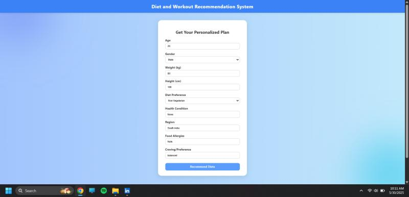

# 🥗 AI-Based Personalized Diet Planner

This project is a personalized diet planner developed as part of our 4th-semester **Database Management Systems (DBMS)** mini project. It leverages artificial intelligence and OpenAI's API to provide meal recommendations tailored to individual users based on their health metrics and dietary goals.

## 💡 Features

- 🧠 AI-powered logic using OpenAI to generate personalized meal plans  
- 🧾 User profiles storing health data (age, weight, height, dietary preferences)  
- 🍴 Calorie and macronutrient-based meal suggestions (Breakfast, Lunch, Dinner)  
- 💾 MongoDB backend for scalable and flexible user + food data management  
- 📊 Simple and user-friendly interface built with HTML & Flask  
- 🧪 Built and tested using Jupyter Notebook during prototyping

## 🛠️ Tech Stack

- **Frontend**: HTML, CSS  
- **Backend**: Python (Flask), Jupyter Notebook  
- **Database**: MongoDB  
- **AI Integration**: OpenAI API  
- **Tools**: VS Code, Git, GitHub, MongoDB Atlas

## 📸 UI Preview



## 🔑 Setup Requirements

- Python 3.x  
- Flask  
- OpenAI Python SDK (`openai`)  
- `pymongo` for MongoDB connection  
- MongoDB Atlas cluster or local MongoDB setup  
- OpenAI API key

## 🚀 How to Run

1. Clone the repository  
   ```bash
   git clone https://github.com/fragan7dsouza/diet-planner-dbms.git
   ```

2. Install the required dependencies  
   ```bash
   pip install flask openai pymongo
   ```

3. Set up environment variables for your OpenAI API key and MongoDB URI  
   Create a `.env` file in the root directory and add:  
   ```env
   OPENAI_API_KEY=your_openai_key  
   MONGO_URI=your_mongodb_connection_string
   ```

4. Run the Flask app  
   ```bash
   python app.py
   ```

5. Open `http://localhost:5000` in your browser

## 📄 License

MIT License
